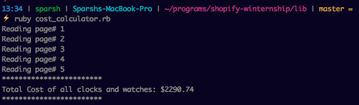

# Shopify-Winternship
This project is a part of the Shopify Winternship 2017 application for the position of developer intern. 

The task is to create a program that calculates how much it will cost to buy all the clocks and watches in the store, [Shopicruit](http://shopicruit.myshopify.com/). This is built on Ruby 2.2.3. I have used the gem [`httparty`](https://github.com/jnunemaker/httparty) to parse through the json pages.

The endpoint for Shopicruit's products can be found at: [shopicruit.myshopify.com/products.json?page=1](shopicruit.myshopify.com/products.json?page=1). Although this is just page 1, the data for all the clocks and watches is spread across multiple pages.


## Installation and Usage

### Installing required Ruby Gems

You can install the required Ruby gems easily using bundler:

1. Install Bundler by using the following command in the terminal.
```console
gem install bundler
```

2 . Move over to the project directory using `cd` command and run the following:
```console
bundle install
```
### Running the program

Once the gems have been installed successfully, you can run the program by passing the cost_calculator.rb file to the Ruby interpreter:

1. Use the `cd` command to move over to the `lib` folder.
2. Then use the following command in terminal to run the game:
```console
ruby cost_calculator.rb
```


## Output

The output should look something like the following:


